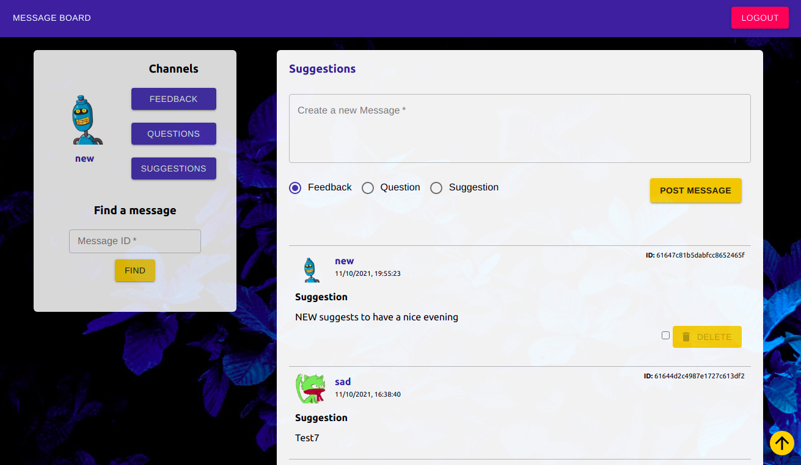

# Fullstack MessageBoard

Task - to build a fullstack (MERN) application which serves as an online MessageBoard. Features of this application include a full REST API, with user data stored in a MongoDB server. Frontend includes access to the [Material UI](https://material-ui.com/) library for an effective and compelling design.

This REST API does the following:

- allows users to view all posts in a chosen category
- allows users to view a single post
- allows users to register
- allows users to login
- allows users to create a new post
- allows users to delete their previous posts

## Live Version is [= here =](https://online-message-board.herokuapp.com/)

### Demo: 
***
